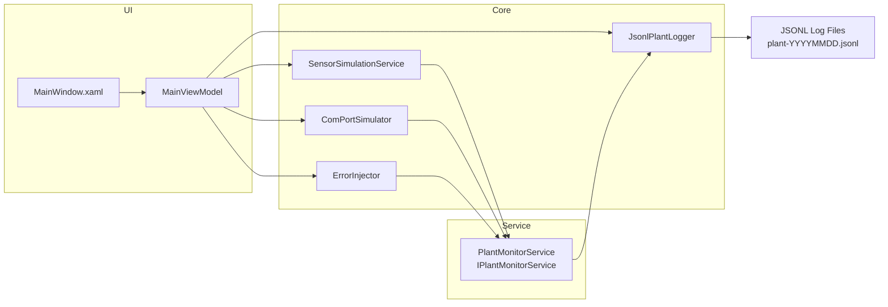

# PlantSimulator (App 1)

Offline WPF + WCF factory simulator. Emits JSONL logs to `%LOCALAPPDATA%\PlantDoctor\logs\plant-YYYYMMDD.jsonl` — this file is the **integration contract** with `PlantDoctor.Agent` (App 2).

## Run

```powershell
dotnet build .\PlantSimulator.sln
dotnet run --project .\src\PlantSimulator.UI\PlantSimulator.UI.csproj
```

## Architecture



## Projects

| Project                       | Role                                        |
| ----------------------------- | ------------------------------------------- |
| `PlantSimulator.Contracts`    | WCF `[ServiceContract]` + DTOs              |
| `PlantSimulator.Core`         | Sensor sim, COM sim, error injection, JSONL logger |
| `PlantSimulator.ServiceHost`  | CoreWCF net.pipe self-host of `IPlantMonitorService` |
| `PlantSimulator.UI`           | WPF/MVVM shell (three-panel layout + Settings) |
| `PlantSimulator.Tests`        | xUnit tests (68 comprehensive tests)          |

## Main Window Panels

| Panel | Description |
| ----- | ----------- |
| **Sensor Readings** (left) | Live DataGrid of 6 simulated sensors (Temperature, Pressure, VibrationX/Y, RPM, Voltage). Values update every 1.5s via DispatcherTimer using random-walk algorithm. Status indicator: green=OK, amber=Warning, red=Critical. |
| **COM Port** (center) | Simulated serial/COM connection panel. Dropdown COM1–COM8, Connect/Disconnect buttons, status light (green=Connected, amber=Disconnected, red=Error), scrolling raw frame log showing TX/RX hex telegrams. |
| **Error & Event Log** (right) | DataGrid of injected errors with Timestamp, Severity, Source, Message, ErrorCode. Toolbar buttons: Sensor Timeout, COM Disconnect, Overflow, Out of Range. |

## Error Injection Scenarios

| Button | Behavior |
| ------ | -------- |
| **Sensor Timeout** | Freezes first sensor value, logs `SENSOR_TIMEOUT` error |
| **COM Disconnect** | Simulates dropped serial mid-transmission, logs `COM_DROPPED` error |
| **Overflow** | Triggers `OverflowException` in checked context, logs full stack trace |
| **Out of Range** | Forces sensor to report `Max * 10`, logs `OUT_OF_RANGE` warning |

## Log Line Schema (JSONL)

Each line is a JSON object:

```json
{
  "timestamp": "2026-01-01T12:00:00Z",
  "level": "Info|Warning|Error|Critical",
  "source": "Sensor|COM|Application",
  "sensorName": "optional",
  "value": "optional",
  "errorCode": "optional",
  "message": "human readable",
  "stackTrace": "optional, full .NET stack trace if exception"
}
```

**This log file is the PRIMARY integration point with PlantDoctor.Agent (App 2).** The agent tails this file using `FileSystemWatcher` to detect new entries in real time.

## WCF Contract

`IPlantMonitorService` is hosted at `net.pipe://localhost/PlantDoctor/monitor` using CoreWCF.

```csharp
[ServiceContract]
public interface IPlantMonitorService
{
    [OperationContract(IsOneWay = true)] void ReportSensorReading(SensorReadingDto dto);
    [OperationContract(IsOneWay = true)] void ReportError(ErrorEventDto dto);
    [OperationContract(IsOneWay = true)] void ReportComEvent(ComEventDto dto);
    [OperationContract] PlantSnapshotDto GetCurrentSnapshot();
}
```

**Why WCF?** Real plant software separates the UI from device communication via a service layer. This pattern mirrors industrial architecture where:
- The UI handles operator interaction
- The service layer manages device communication
- The core logic is independent of both

**Future extension:** The service can be re-exposed over `net.tcp` so `PlantDoctor.Agent` can subscribe to events cross-process (see `ServiceHostBuilder.cs`).

## Settings

File → Settings opens a dialog to adjust:
- Sensor update interval (ms)
- Log folder path
- Active sensors (multi-select)

## Offline Guarantee

No `HttpClient`, no `WebRequest`, no cloud SDKs. Serilog uses file sink only. All communication is in-process via CoreWCF net.pipe.

## Tests

```powershell
dotnet test .\tests\PlantSimulator.Tests\PlantSimulator.Tests.csproj
```

12+ unit tests covering sensor simulation, error injection, COM simulation, and JSONL logging.
