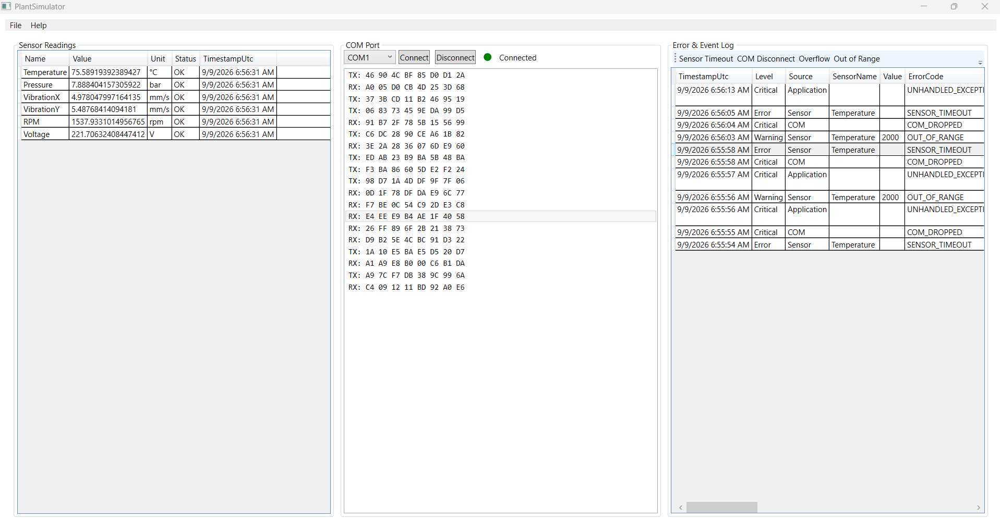

# PlantSimulator — User Manual

**Version 1.0** | September 2026

---

## Table of Contents

1. [Introduction](#1-introduction)
2. [Getting Started](#2-getting-started)
3. [Main Window Overview](#3-main-window-overview)
4. [Working with Sensor Readings](#4-working-with-sensor-readings)
5. [Managing COM Port Simulation](#5-managing-com-port-simulation)
6. [Injecting Error Scenarios](#6-injecting-error-scenarios)
7. [Settings Dialog](#7-settings-dialog)
8. [Log Files & Integration](#8-log-files--integration)
9. [Troubleshooting](#9-troubleshooting)
10. [FAQ](#10-faq)
11. [Appendix A — Error Code Reference](#appendix-a--error-code-reference)
12. [Appendix B — Sensor Specifications](#appendix-b--sensor-specifications)

---

## 1. Introduction

### 1.1 What is PlantSimulator?

PlantSimulator is an **offline desktop application** that simulates a factory plant monitoring system. It generates realistic sensor data, simulates serial (COM) port communication, and injects error scenarios — all without requiring any physical hardware, network connection, or cloud service.

The application is designed for:

- **Training and demonstration** of plant monitoring workflows
- **Testing** downstream applications (such as `PlantDoctor.Agent`) that consume sensor logs
- **Development** of industrial monitoring software
- **Education** about sensor data patterns, error handling, and WCF service architecture

### 1.2 Key Features

| Feature | Description |
| ------- | ----------- |
| **6 Simulated Sensors** | Temperature, Pressure, Vibration (X/Y), RPM, Voltage — each with realistic random-walk behavior |
| **COM Port Simulation** | Simulated serial communication with TX/RX hex frames on selectable COM1–COM8 ports |
| **Error Injection** | Four error scenarios: Sensor Timeout, COM Disconnect, Overflow Exception, Out of Range |
| **JSONL Logging** | Structured JSON-lines log files with daily rollover, compatible with App 2 (`PlantDoctor.Agent`) |
| **WCF Service** | Self-hosted WCF service (`net.pipe`) exposing sensor data, errors, and COM events |
| **Three-Panel UI** | Intuitive layout: Sensor Readings, COM Port, Error & Event Log |
| **Offline-First** | No internet connection, no HTTP calls, no external dependencies — runs entirely on the local machine |

### 1.3 System Requirements

| Requirement | Minimum | Recommended |
| ----------- | ------- | ----------- |
| **Operating System** | Windows 10 (64-bit) | Windows 11 (64-bit) |
| **.NET Runtime** | .NET 8.0 Runtime | .NET 8.0 SDK |
| **Memory** | 2 GB RAM | 4 GB RAM |
| **Disk Space** | 100 MB | 500 MB |
| **Display** | 1280 × 720 pixels | 1920 × 1080 pixels |

> **Note:** The application requires **.NET 8.0** (or later). Download from [https://dotnet.microsoft.com/download/dotnet/8.0](https://dotnet.microsoft.com/download/dotnet/8.0).

---

## 2. Getting Started

### 2.1 Installation Prerequisites

Before running PlantSimulator, ensure the following are installed:

1. **.NET 8.0 SDK** — Required to build and run the application
2. **Windows** — The application uses WPF (Windows Presentation Foundation) and WCF net.pipe bindings

Verify your .NET installation:

```powershell
dotnet --version
```

This should return `8.0.x` or higher.

### 2.2 Building the Application

Open a PowerShell terminal in the PlantSimulator directory and run:

```powershell
cd c:\Users\PLT3KOR\Documents\AI\PlantDoctor\PlantDoctor\apps\PlantSimulator
dotnet build .\PlantSimulator.sln
```

A successful build produces output similar to:

```
Build succeeded.
    0 Warning(s)
```

> **Note:** You may see NuGet vulnerability warnings for `CoreWCF.Primitives` and `CoreWCF.NetNamedPipe`. These are informational only and do not affect functionality.

### 2.3 Launching PlantSimulator

After building, launch the application:

```powershell
dotnet run --project .\src\PlantSimulator.UI\PlantSimulator.UI.csproj
```

Alternatively, from Visual Studio:

1. Open `PlantSimulator.sln`
2. Set `PlantSimulator.UI` as the startup project
3. Press **F5** or click the **Start** button

### 2.4 First Launch — What to Expect

When PlantSimulator starts for the first time:

1. **The main window opens** with three empty panels (Sensor Readings, COM Port, Error & Event Log)
2. **A WCF service starts** at `net.pipe://localhost/PlantDoctor/monitor` (invisible to the user)
3. **Sensor data begins updating** every 1.5 seconds with simulated values
4. **A log file is created** at `%LOCALAPPDATA%\PlantDoctor\logs\plant-YYYYMMDD.jsonl`

The application is now ready for use. No configuration is required.

---

## 3. Main Window Overview

### 3.1 Three-Panel Layout

The main window is divided into **three equal-width panels**, arranged left to right:

```
┌─────────────────────────────────────────────────────────────────┐
│  File  │  Help                                                  │
├─────────────────────────────────────────────────────────────────┤
│  Sensor Readings  │  COM Port     │  Error & Event Log         │
│  ┌───────────┐   │  ┌─────────┐  │  ┌──────────────────────┐  │
│  │ Name  Val │   │  │ COM1    │  │  │ Timestamp │ Severity │  │
│  │ Temp  75  │   │  │ Connect │  │  │ 12:00:01  │ Info     │  │
│  │ Press  8  │   │  │ Disc.   │  │  │ 12:00:02  │ Error    │  │
│  │ VibX  5   │   │  │         │  │  │ 12:00:03  │ Critical │  │
│  │ VibY  5   │   │  │         │  │  │              │          │  │
│  │ RPM 1500  │   │  │         │  │  │              │          │  │
│  │ Volt 230  │   │  │         │  │  │              │          │  │
│  └───────────┘   │  └─────────┘  │  └──────────────────────┘  │
└─────────────────────────────────────────────────────────────────┘
```



### 3.2 Menu Bar

The menu bar contains two menus:

| Menu | Item | Action |
| ---- | ---- | ------ |
| **File** | Settings... | Opens the Settings dialog (see Section 7) |
| **File** | Exit | Closes the application cleanly |
| **Help** | About | Displays version and copyright information |

### 3.3 Status Indicators (Color Legend)

The application uses a consistent **traffic-light color scheme** throughout:

| Color | Status | Meaning |
| ----- | ------ | ------- |
| 🟢 **Green** | OK / Connected | Normal operation |
| 🟠 **Orange** | Warning | Approaching threshold limits |
| 🔴 **Red** | Critical / Error | Threshold exceeded or fault condition |
| ⚪ **Gray** | Disconnected | No active connection |

---

## 4. Working with Sensor Readings

### 4.1 Understanding the Sensor DataGrid

The **left panel** displays a live DataGrid showing readings from all 6 simulated sensors. Each row represents one sensor, and the columns show:

| Column | Description |
| ------ | ----------- |
| **Name** | Sensor identifier (e.g., Temperature, Pressure) |
| **Value** | Current simulated reading (numeric) |
| **Unit** | Measurement unit (°C, bar, mm/s, rpm, V) |
| **Status** | Current status: OK, Warning, or Critical |
| **Timestamp** | UTC time of the last reading |

### 4.2 Sensor Types & Ranges

PlantSimulator includes **6 default sensors**, each configured with realistic industrial ranges:

| Sensor | Unit | Min | Max | Initial | Warning | Critical |
| ------ | ---- | --- | --- | ------- | ------- | -------- |
| Temperature | °C | 0 | 200 | 75 | 140 | 170 |
| Pressure | bar | 0 | 20 | 8 | 15 | 18 |
| VibrationX | mm/s | 0 | 50 | 5 | 30 | 40 |
| VibrationY | mm/s | 0 | 50 | 5 | 30 | 40 |
| RPM | rpm | 0 | 6000 | 1500 | 5000 | 5500 |
| Voltage | V | 0 | 500 | 230 | 400 | 450 |

> **Tip:** The **Warning** and **Critical** thresholds are configurable per sensor in the Settings dialog (future enhancement).

### 4.3 Status Colors (OK / Warning / Critical)

Each sensor's status is determined by its current value relative to its thresholds:

```
Value < WarningThreshold  →  OK      (Green)
WarningThreshold ≤ Value < CriticalThreshold  →  Warning  (Orange)
Value ≥ CriticalThreshold  →  Critical (Red)
```

**Example:** Temperature at 145°C triggers a **Warning** (between 140 and 170). Temperature at 175°C triggers **Critical** (above 170).

### 4.4 Sensor Update Interval

By default, sensors update **every 1.5 seconds** (1500 ms). The update interval can be changed in the **Settings** dialog (see Section 7).

The sensor values follow a **random-walk algorithm**:

1. Each tick, the value changes by a small random step (±1% of the sensor's range)
2. The value is clamped to stay within the sensor's Min–Max bounds
3. The step direction is random (up or down), creating natural-looking fluctuations

### 4.5 Freezing a Sensor (via Error Injection)

To freeze a sensor at its current value (simulating a sensor failure):

1. Click the **Sensor Timeout** button in the Error & Event Log panel (see Section 6.2)
2. The first sensor in the list will stop updating
3. A `SENSOR_TIMEOUT` error is logged with Error severity

To resume normal operation, restart the application.

---

## 5. Managing COM Port Simulation

### 5.1 Selecting a COM Port

The **center panel** simulates a serial/COM port connection. Use the dropdown to select a port:

- **COM1** through **COM8** are available
- The default selection is **COM1**

### 5.2 Connecting & Disconnecting

| Button | Action |
| ------ | ------ |
| **Connect** | Establishes a simulated connection to the selected COM port |
| **Disconnect** | Closes the simulated connection |

**Steps to connect:**

1. Select a COM port from the dropdown (e.g., COM3)
2. Click the **Connect** button
2. The status indicator turns 🟠 **orange** and displays "Connected"
4. TX/RX hex frames begin appearing in the scrolling log below

**Steps to disconnect:**

1. Click the **Disconnect** button
2. The status indicator turns 🟠 **orange** and displays "Disconnected"
3. Hex frame generation stops

### 5.3 Reading TX/RX Hex Frames

When connected, the COM port simulator generates **hexadecimal telegrams** that simulate serial communication:

```
TX: AA BB CC DD EE FF 00 11
RX: 12 34 56 78 9A BC DE F0
```

Each frame consists of:

- **Direction prefix**: `TX:` (transmit) or `RX:` (receive)
- **8 hex bytes**: Two-digit hexadecimal values separated by spaces

The frames scroll automatically, showing the **most recent 200 frames**. Older frames are discarded to maintain performance.

### 5.4 COM Status Indicators

| Status | Color | Meaning |
| ------ | ----- | ------- |
| **Connected** | � Orange | Active serial connection |
| **Disconnected** | 🟢 Green | No active connection |
| **Error** | 🔴 Red | Connection fault (e.g., COM Disconnect injection) |

---

## 6. Injecting Error Scenarios

### 6.1 Error & Event Log DataGrid

The **right panel** displays a log of all injected errors and events. Each entry shows:

| Column | Description |
| ------ | ----------- |
| **Timestamp** | UTC time when the error occurred |
| **Level** | Severity: Info, Warning, Error, or Critical |
| **Source** | Origin: Sensor, COM, or Application |
| **SensorName** | Name of the affected sensor (if applicable) |
| **Value** | The anomalous value (if applicable) |
| **ErrorCode** | Machine-readable error code |
| **Message** | Human-readable description |
| **StackTrace** | Full .NET stack trace (for exceptions) |

### 6.2 Sensor Timeout — How & Why

**What it does:**

1. Freezes the first sensor's value at its current reading
2. The sensor stops updating until the application is restarted
3. A `SENSOR_TIMEOUT` error is logged with **Error** severity

**When to use:**

- Simulate a sensor that has stopped reporting data
- Test downstream alerting systems
- Demonstrate sensor failure behavior

**Example log entry:**

```json
{
  "timestamp": "2026-09-09T12:00:00Z",
  "level": "Error",
  "source": "Sensor",
  "sensorName": "Temperature",
  "errorCode": "SENSOR_TIMEOUT",
  "message": "Sensor 'Temperature' has not reported within the expected interval."
}
```

### 6.3 COM Disconnect — How & Why

**What it does:**

1. Simulates a dropped serial connection mid-transmission
2. Sets the COM port status to **Error** (red)
3. A `COM_DROPPED` error is logged with **Critical** severity

**When to use:**

- Simulate a cable disconnection or serial port failure
- Test reconnection logic in downstream applications
- Demonstrate critical fault handling

**Example log entry:**

```json
{
  "timestamp": "2026-09-09T12:00:00Z",
  "level": "Critical",
  "source": "COM",
  "errorCode": "COM_DROPPED",
  "message": "COM port COM3 disconnected during transmission."
}
```

### 6.4 Overflow Exception — How & Why

**What it does:**

1. Triggers an actual `OverflowException` in a checked context
2. Captures the full .NET stack trace
3. Logs the error with **Critical** severity and source "Application"

**When to use:**

- Simulate an unhandled arithmetic overflow in plant software
- Test exception handling and logging in downstream applications
- Demonstrate stack trace capture

**Example log entry:**

```json
{
  "timestamp": "2026-09-09T12:00:00Z",
  "level": "Critical",
  "source": "Application",
  "errorCode": "UNHANDLED_EXCEPTION",
  "message": "Arithmetic operation resulted in an overflow.",
  "stackTrace": "   at PlantSimulator.Core.Errors.ErrorInjector.OverflowException()..."
}
```

### 6.5 Out of Range Value — How & Why

**What it does:**

1. Forces the first sensor to report a value of `Max × 10` (10× the normal maximum)
2. The sensor continues reporting this out-of-range value on subsequent ticks
3. An `OUT_OF_RANGE` warning is logged with **Warning** severity

**When to use:**

- Simulate a sensor malfunction producing unrealistic readings
- Test threshold detection and alerting
- Demonstrate out-of-range data handling

**Example log entry:**

```json
{
  "timestamp": "2026-09-09T12:00:00Z",
  "level": "Warning",
  "source": "Sensor",
  "sensorName": "Temperature",
  "value": "2000",
  "errorCode": "OUT_OF_RANGE",
  "message": "Sensor 'Temperature' reported 2000°C — outside valid bounds."
}
```

---

## 7. Settings Dialog

### 7.1 Opening Settings

1. Click **File → Settings...** in the menu bar
2. The Settings dialog opens as a modal window

### 7.2 Adjusting Sensor Update Interval

The **Sensor Update Interval** field controls how frequently sensors are updated (in milliseconds).

| Default | Minimum | Recommended |
| ------- | ------- | ----------- |
| 1500 ms | 100 ms | 500–5000 ms |

**To change:**

1. Enter a new value in the text box (e.g., `1000` for 1 second)
2. Click **OK** to apply

> **Note:** The interval change takes effect the next time the application starts. The current session continues with the existing interval.

### 7.3 Changing Log Folder Path

The **Log Folder** field specifies where JSONL log files are stored.

| Default | Example |
| ------- | ------- |
| `%LOCALAPPDATA%\PlantDoctor\logs` | `C:\Users\YourName\AppData\Local\PlantDoctor\logs` |

**To change:**

1. Enter a new folder path in the text box
2. The folder is created automatically if it does not exist
3. Click **OK** to apply

> **Note:** The folder path change takes effect the next time the application starts.

### 7.4 Toggling Active Sensors

The **Active Sensors** list allows you to select which sensors are included in the simulation.

**To modify:**

1. Check or uncheck sensors in the multi-select list box
2. At least one sensor must remain selected
3. Click **OK** to apply

> **Note:** Sensor selection changes take effect the next time the application starts.

---

## 8. Log Files & Integration

### 8.1 Log File Location & Naming

Log files are stored in the configured log folder (default: `%LOCALAPPDATA%\PlantDoctor\logs\`).

**Naming convention:**

```
plant-YYYYMMDD.jsonl
```

**Examples:**

| Date | File Name |
| ---- | --------- |
| September 9, 2026 | `plant-20260909.jsonl` |
| January 1, 2027 | `plant-20270101.jsonl` |

### 8.2 JSONL Log Format Explained

Each line in the log file is a **JSON object** (JSON Lines format). The format varies slightly depending on the event type.

**Sensor Reading Log Entry:**

```json
{
  "timestamp": "2026-09-09T12:00:00.123Z",
  "level": "Info",
  "source": "Sensor",
  "sensorName": "Temperature",
  "value": "75.123",
  "message": "Temperature=75.12°C"
}
```

**Error Event Log Entry:**

```json
{
  "timestamp": "2026-09-09T12:00:01.456Z",
  "level": "Critical",
  "source": "Application",
  "errorCode": "UNHANDLED_EXCEPTION",
  "message": "Arithmetic operation resulted in an overflow.",
  "stackTrace": "   at PlantSimulator.Core.Errors.ErrorInjector.OverflowException()..."
}
```

**COM Event Log Entry:**

```json
{
  "timestamp": "2026-09-09T12:00:02.789Z",
  "level": "Info",
  "source": "COM",
  "message": "COM COM1 Connected"
}
```

### 8.3 Reading Log Files (with App 2 — PlantDoctor.Agent)

PlantSimulator is designed to work with **PlantDoctor.Agent (App 2)**, which monitors the log file in real time using a `FileSystemWatcher`.

**How it works:**

1. PlantSimulator writes log entries to `plant-YYYYMMDD.jsonl`
2. The file is opened with `FileShare.ReadWrite`, allowing other processes to read it concurrently
3. PlantDoctor.Agent detects new entries and processes them

**To verify the log file is accessible:**

```powershell
# Open the log file in a text editor
notepad "$env:LOCALAPPDATA\PlantDoctor\logs\plant-$(Get-Date -Format yyyyMMdd).jsonl"
```

### 8.4 Daily Log Rollover

Log files automatically **roll over at midnight UTC**:

- Each day gets its own file (e.g., `plant-20260909.jsonl`, `plant-20260910.jsonl`)
- Old log files are preserved and never overwritten
- The application creates a new file automatically when the date changes

> **Tip:** To archive old logs, move or copy the `.jsonl` files to a backup location before they grow too large.

---

## 9. Troubleshooting

### 9.1 App Won't Start

| Symptom | Cause | Solution |
| ------- | ----- | -------- |
| `dotnet : Not found` | .NET 8.0 SDK not installed | Install .NET 8.0 SDK from [dotnet.microsoft.com](https://dotnet.microsoft.com/download/dotnet/8.0) |
| Blank window, no data | WCF service failed to start | Check for another instance running; close it and restart |
| Crash on startup | Missing dependencies | Run `dotnet restore` then `dotnet build` |

### 9.2 Sensors Not Updating

| Symptom | Cause | Solution |
| ------- | ----- | -------- |
| Values stuck at initial | Sensor frozen by timeout injection | Restart the application |
| Values not changing | Update interval set too high | Open Settings and reduce interval (e.g., 1500 ms) |
| Panel empty | Application just started | Wait 1.5 seconds for the first update cycle |

### 9.3 COM Port Not Connecting

| Symptom | Cause | Solution |
| ------- | ----- | -------- |
| Status stays "Disconnected" | Connect button not clicked | Click the **Connect** button |
| Status shows "Error" | COM Disconnect injected | Restart the application; click Connect again |
| No hex frames appearing | Port not connected | Verify status shows "Connected" (green) |

### 9.4 Log File Not Created

| Symptom | Cause | Solution |
| ------- | ----- | -------- |
| No file in log folder | Application not yet logged data | Trigger a sensor reading or error event |
| Permission denied | Log folder not writable | Check folder permissions; run as administrator |
| File in wrong location | Custom log folder configured | Check Settings dialog for configured path |

### 9.5 WCF Service Port Already in Use

| Symptom | Cause | Solution |
| ------- | ----- | -------- |
| `AddressAccessDeniedException` | Another process using `net.pipe://localhost/PlantDoctor/monitor` | Close the other process; restart PlantSimulator |
| `InvalidOperationException` | Multiple PlantSimulator instances running | Close all instances; start only one |

### 9.6 General Tips

- **Restart the application** to reset all state (frozen sensors, COM errors, out-of-range values)
- **Check the log file** for detailed error information if the UI shows unexpected behavior
- **Run only one instance** of PlantSimulator at a time to avoid WCF port conflicts

---

## 10. FAQ

### Is this a real plant system?

No. PlantSimulator is a **simulation**. It generates random-walk sensor values and simulated COM port frames. It does not communicate with any physical hardware, PLC, or industrial device.

### Can I use this for training?

Yes. PlantSimulator is designed for training, demonstration, and testing purposes. It simulates realistic sensor behavior and error scenarios without risking any physical equipment.

### How does the random-walk algorithm work?

Each sensor tick, the value changes by a small random step:

```
step = (Max - Min) × 0.01 × (random(-0.5 to 0.5))
newValue = clamp(currentValue + step, Min, Max)
```

This creates natural-looking fluctuations that stay within the sensor's valid range.

### What is the WCF service used for?

The WCF service (`IPlantMonitorService`) exposes sensor readings, error events, and COM events over a named pipe (`net.pipe`). This allows other processes (such as PlantDoctor.Agent) to subscribe to plant data without reading the log file directly.

### Can I add custom sensors?

Currently, the 6 default sensors are hardcoded. To add custom sensors, modify the `DefaultSensors.cs` file and rebuild the application.

### How do I stop the application?

Click **File → Exit** in the menu bar. The application closes the WCF service and disposes resources cleanly.

---

## Appendix A — Error Code Reference

| Error Code | Level | Source | Description | Recovery |
| ---------- | ----- | ------ | ----------- | -------- |
| `SENSOR_TIMEOUT` | Error | Sensor | Sensor has not reported within the expected interval | Restart application; check sensor connection |
| `COM_DROPPED` | Critical | COM | COM port disconnected during transmission | Reconnect COM port; check cable |
| `UNHANDLED_EXCEPTION` | Critical | Application | Unhandled arithmetic overflow exception | Restart application; check for software bugs |
| `OUT_OF_RANGE` | Warning | Sensor | Sensor reported a value outside valid bounds | Investigate sensor calibration; check for malfunction |

---

## Appendix B — Sensor Specifications

### Temperature Sensor

| Property | Value |
| -------- | ----- |
| **Name** | Temperature |
| **Unit** | °C (degrees Celsius) |
| **Range** | 0 – 200 °C |
| **Initial Value** | 75 °C |
| **Warning Threshold** | 140 °C |
| **Critical Threshold** | 170 °C |
| **Typical Use** | Furnace, reactor, or engine temperature monitoring |

### Pressure Sensor

| Property | Value |
| -------- | ----- |
| **Name** | Pressure |
| **Unit** | bar |
| **Range** | 0 – 20 bar |
| **Initial Value** | 8 bar |
| **Warning Threshold** | 15 bar |
| **Critical Threshold** | 18 bar |
| **Typical Use** | Hydraulic system, pipeline, or boiler pressure monitoring |

### Vibration Sensors (X and Y Axes)

| Property | Value |
| -------- | ----- |
| **Name** | VibrationX / VibrationY |
| **Unit** | mm/s (millimeters per second) |
| **Range** | 0 – 50 mm/s |
| **Initial Value** | 5 mm/s |
| **Warning Threshold** | 30 mm/s |
| **Critical Threshold** | 40 mm/s |
| **Typical Use** | Rotating machinery health monitoring (bearing wear, imbalance) |

### RPM Sensor

| Property | Value |
| -------- | ----- |
| **Name** | RPM |
| **Unit** | rpm (revolutions per minute) |
| **Range** | 0 – 6000 rpm |
| **Initial Value** | 1500 rpm |
| **Warning Threshold** | 5000 rpm |
| **Critical Threshold** | 5500 rpm |
| **Typical Use** | Motor, turbine, or spindle speed monitoring |

### Voltage Sensor

| Property | Value |
| -------- | ----- |
| **Name** | Voltage |
| **Unit** | V (volts) |
| **Range** | 0 – 500 V |
| **Initial Value** | 230 V |
| **Warning Threshold** | 400 V |
| **Critical Threshold** | 450 V |
| **Typical Use** | Power supply monitoring, electrical system health |

---

*End of User Manual*
