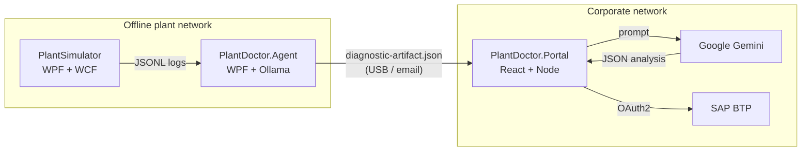

# Architecture

## Overview

PlantDoctor is a three-tier hackathon system demonstrating an air-gapped-to-cloud diagnostic pipeline.

## Layering (per app)

| Layer          | PlantSimulator                          | PlantDoctor.Agent                   | PlantDoctor.Portal            |
| -------------- | --------------------------------------- | ----------------------------------- | ----------------------------- |
| Presentation   | `PlantSimulator.UI` (WPF/MVVM)          | `PlantDoctor.Agent.UI` (WPF/MVVM)   | `client/` (React + TS)        |
| Application    | ViewModels + service clients            | ViewModels + service clients        | React hooks + API client      |
| Domain / Core  | `PlantSimulator.Core`                   | `PlantDoctor.Agent.Core`            | `shared/` types + zod schemas |
| Infrastructure | `PlantSimulator.ServiceHost` (WCF)      | Ollama HTTP client, FileSystemWatcher | `server/` Express, Gemini, SAP BTP clients |
| Contracts      | `PlantSimulator.Contracts`              | Artifact model (mirrors schema)     | `shared/` interfaces          |

## Contracts

- **Log line schema** — JSONL emitted by PlantSimulator, consumed by PlantDoctor.Agent. See PlantSimulator README.
- **DiagnosticArtifact** — see [`contracts/diagnostic-artifact.schema.json`](./contracts/diagnostic-artifact.schema.json). Emitted by App 2, consumed by App 3.
- **GeminiAnalysisResult** — internal to Portal; see Portal README.
